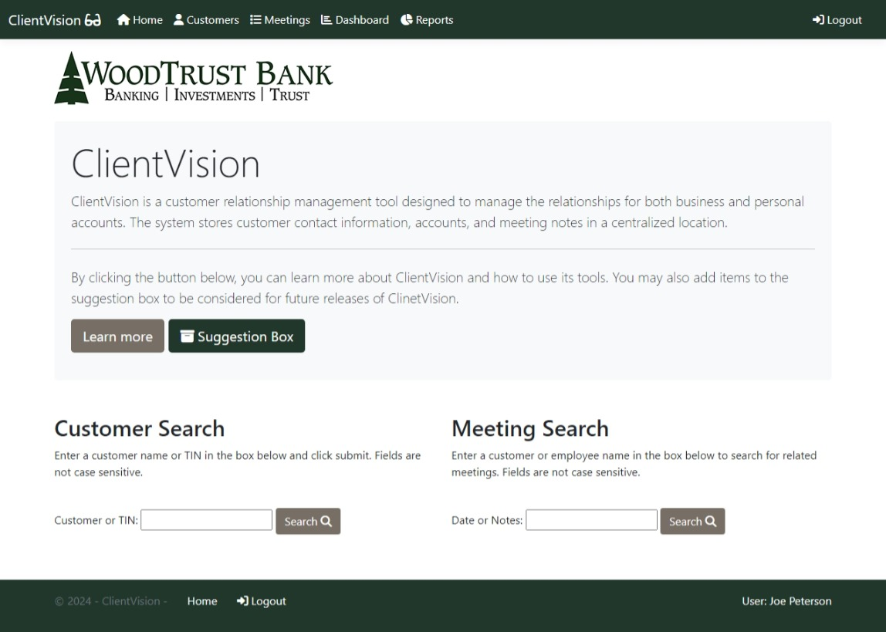
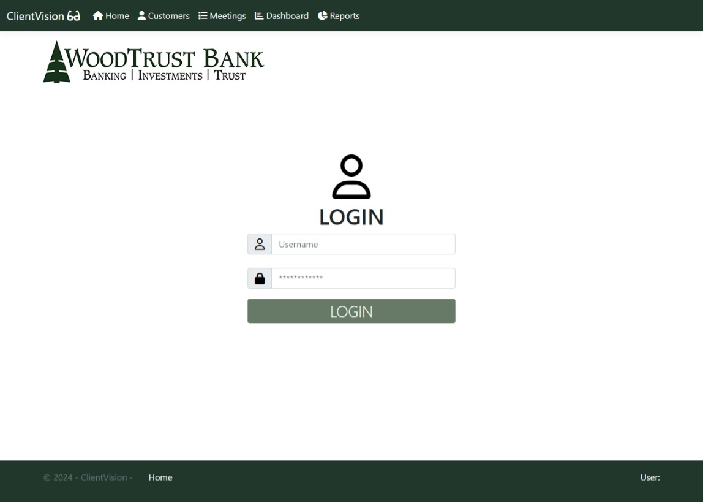
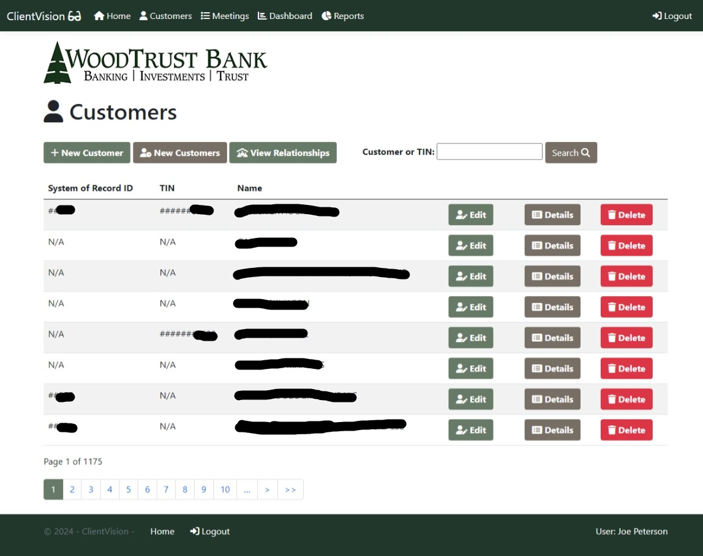
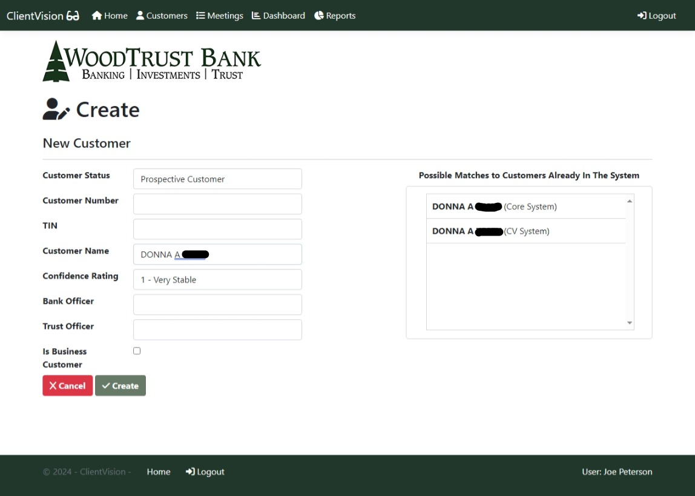
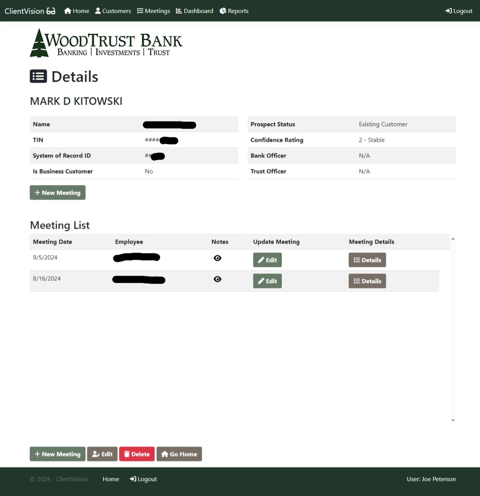
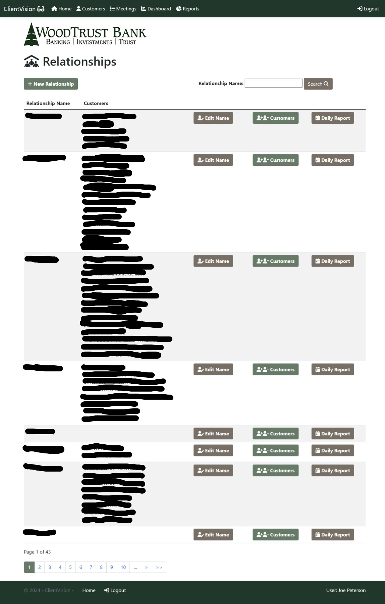
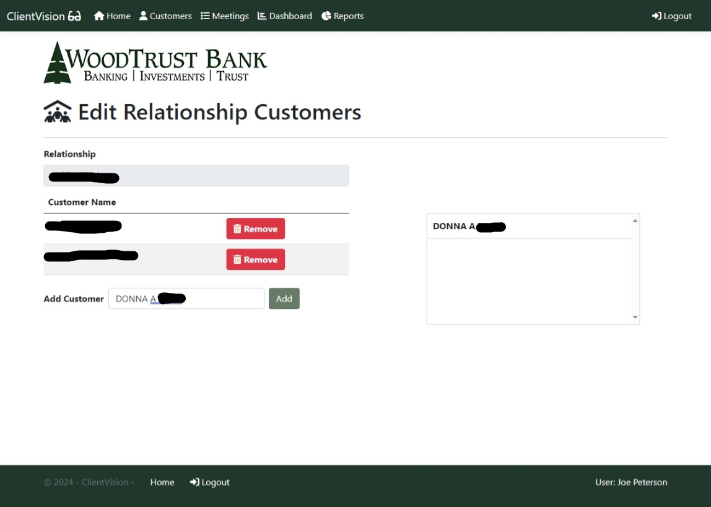
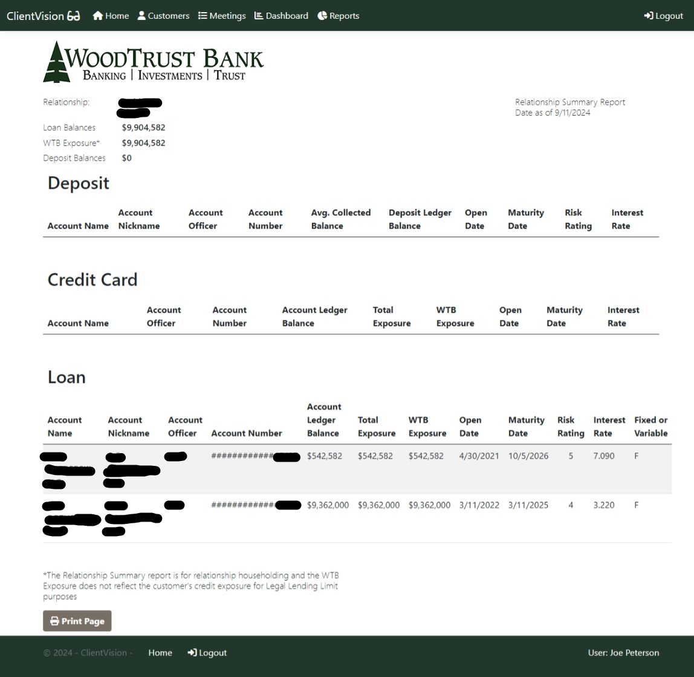

# ClientVision-CRM (Admin View)
ClientVision is a CRM web application built for WoodTrust Bank to manage customer + account data and also document interactions between bank employees and clients. 

## Home Page 

## Login Page
 

## All Customers Page

## Create Customer Page

## Customer Details Page

## Recent Customers Report Page

## Bank Relationships Page

## Adding/Removing Clients Bank Relationships Page

## Daily Report Bank Relationship Page

