# ClientVision-CRM (Admin View)
ClientVision is a CRM web application built for WoodTrust Bank to manage customer + account data and also document interactions between bank employees and clients. 

## Home Page 

## Login Page
 

## All Customers Page

## Create Customer Page

## Customer Details Page
--Missing Image--

## Recent Customers Report Page

## Bank Relationships Page

## Adding/Removing Clients Bank Relationships Page

## Daily Report Bank Relationship Page

## All Meetings Page
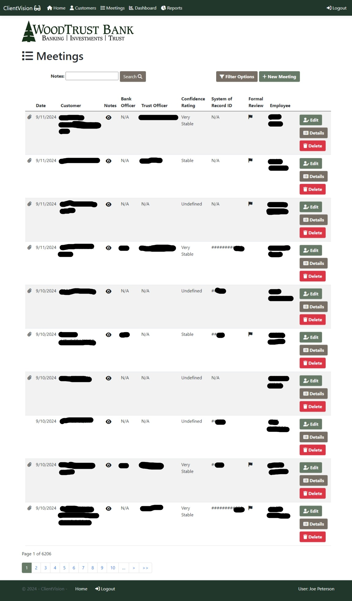

## Meeting Notes Popups
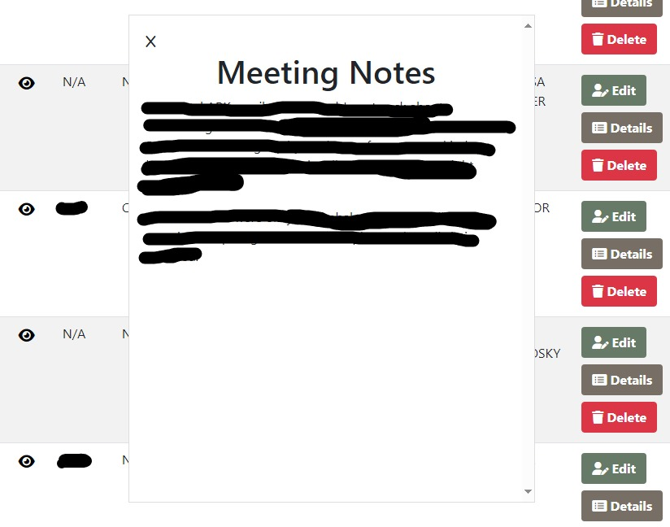

## Meeting Filter Form Popup
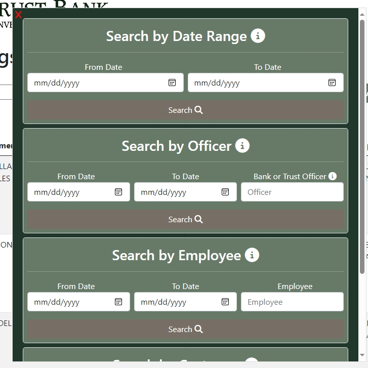

## Create Meeting Page
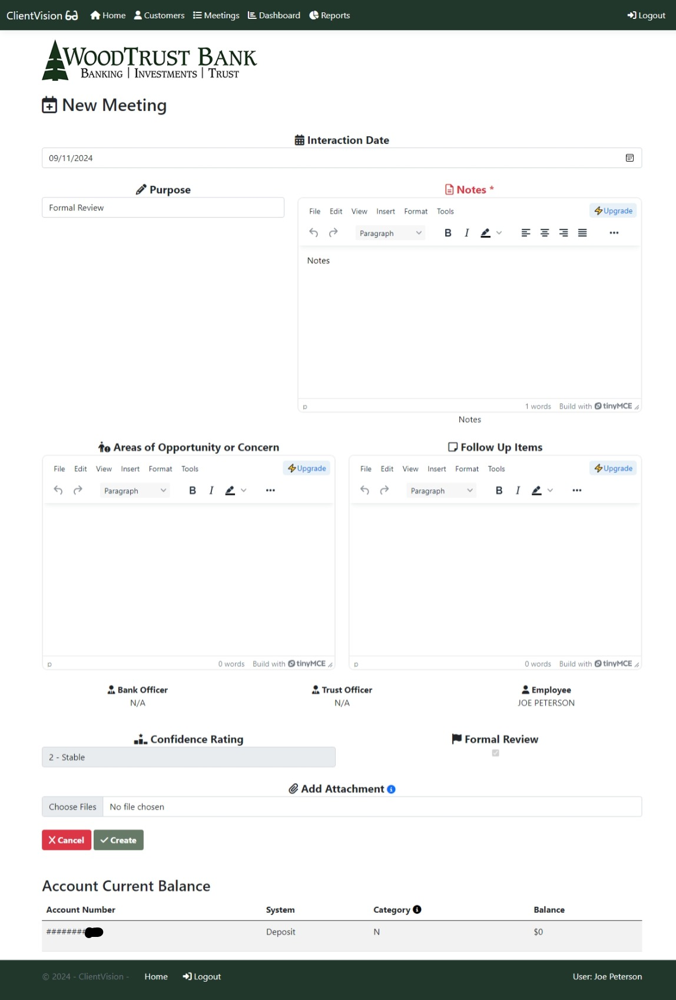

## Meeting Details Page
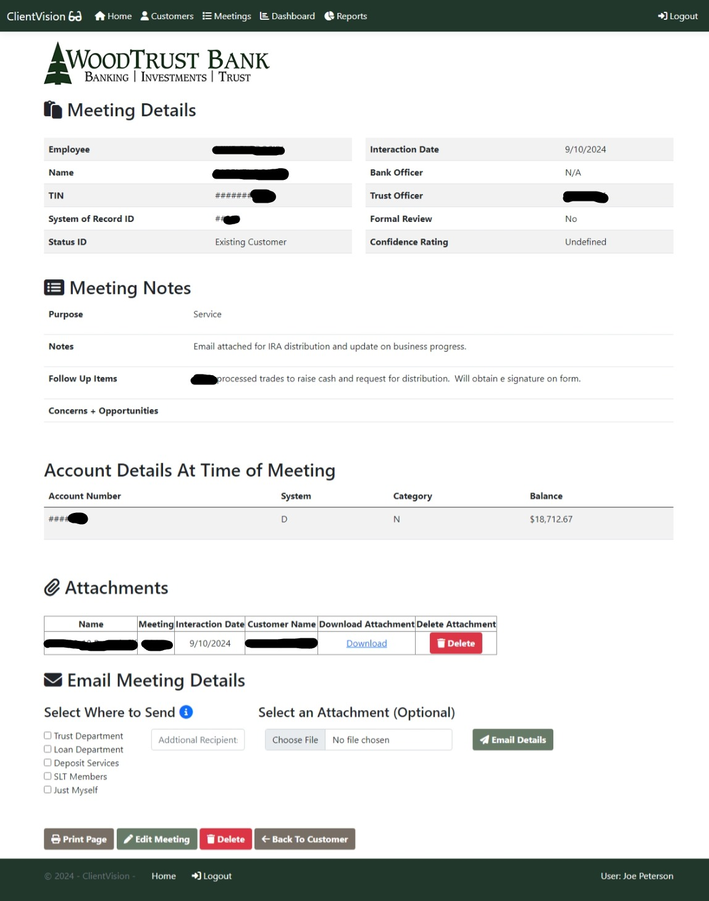

## Report Generator Page
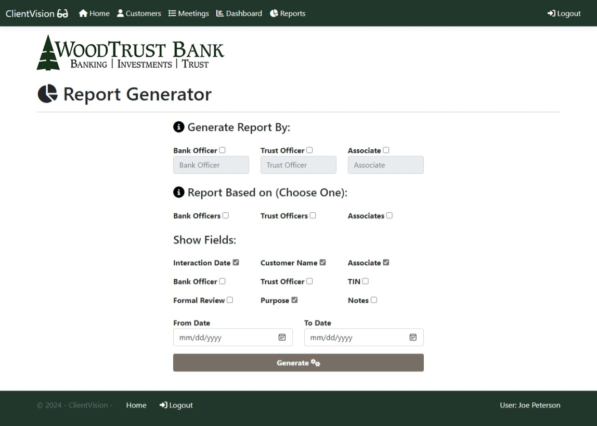

## Report Results Page
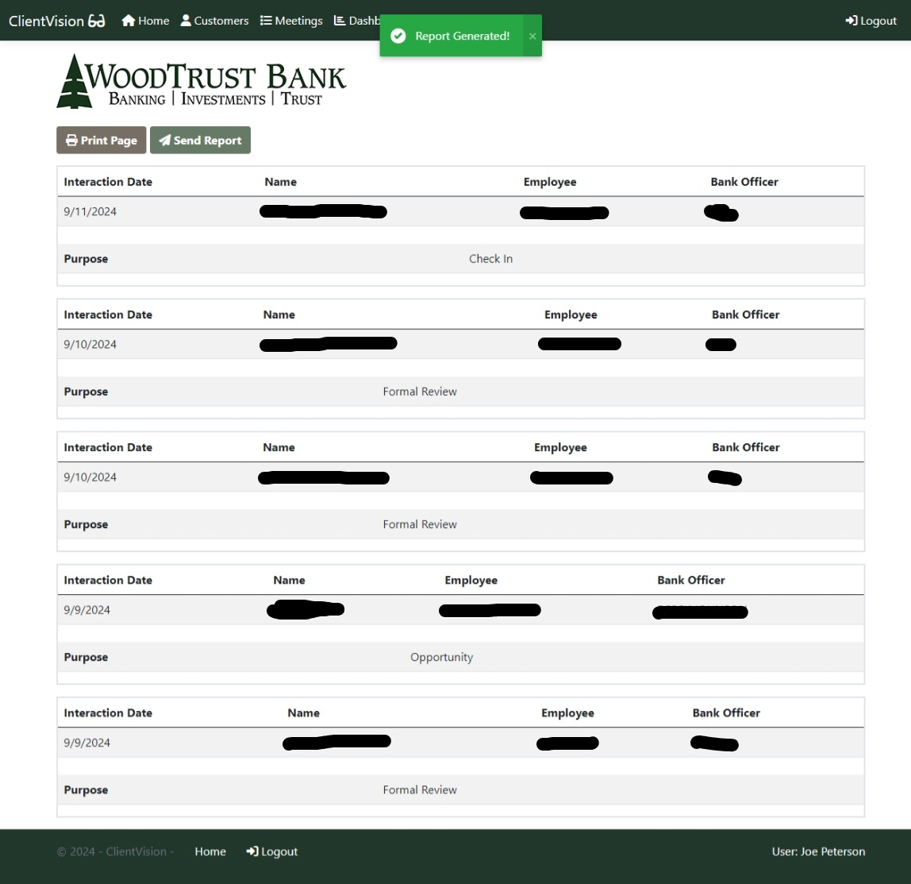

## Popup Email Report Results
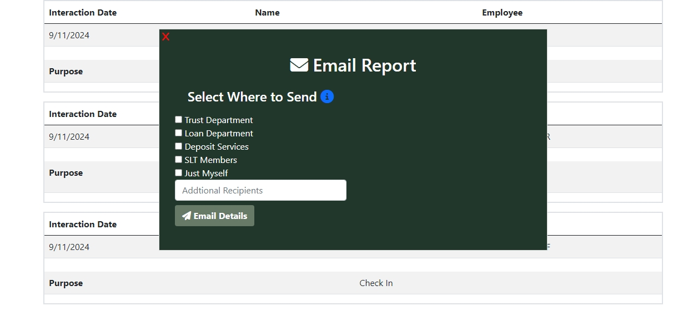

## User dashboard Page (Admin)
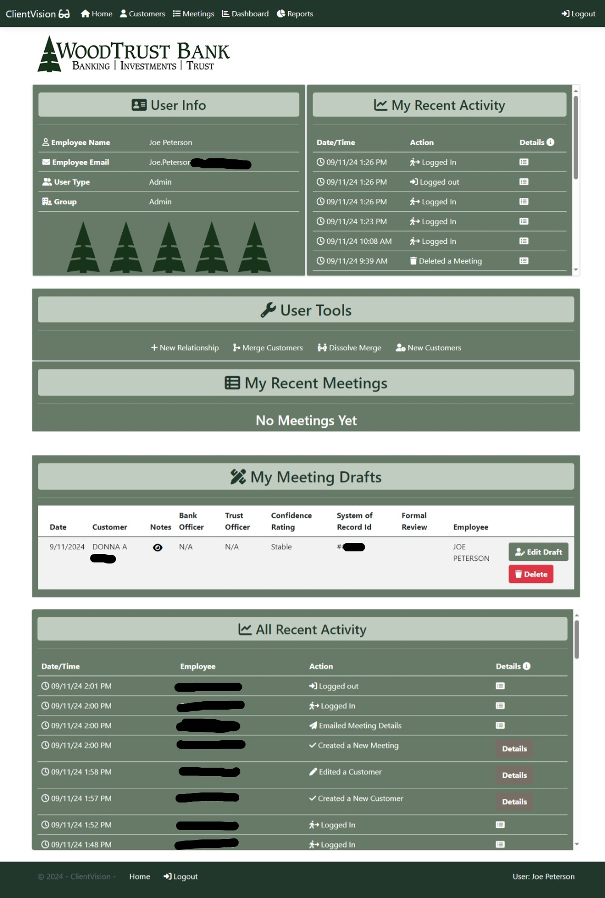

## Merge Customer Records Page
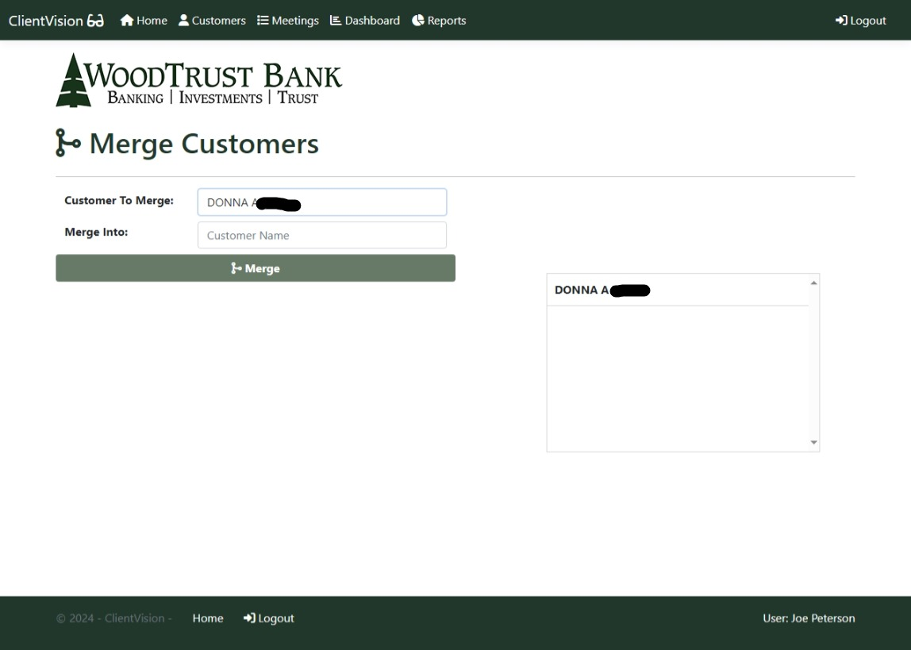

## Dissolve Merge Page
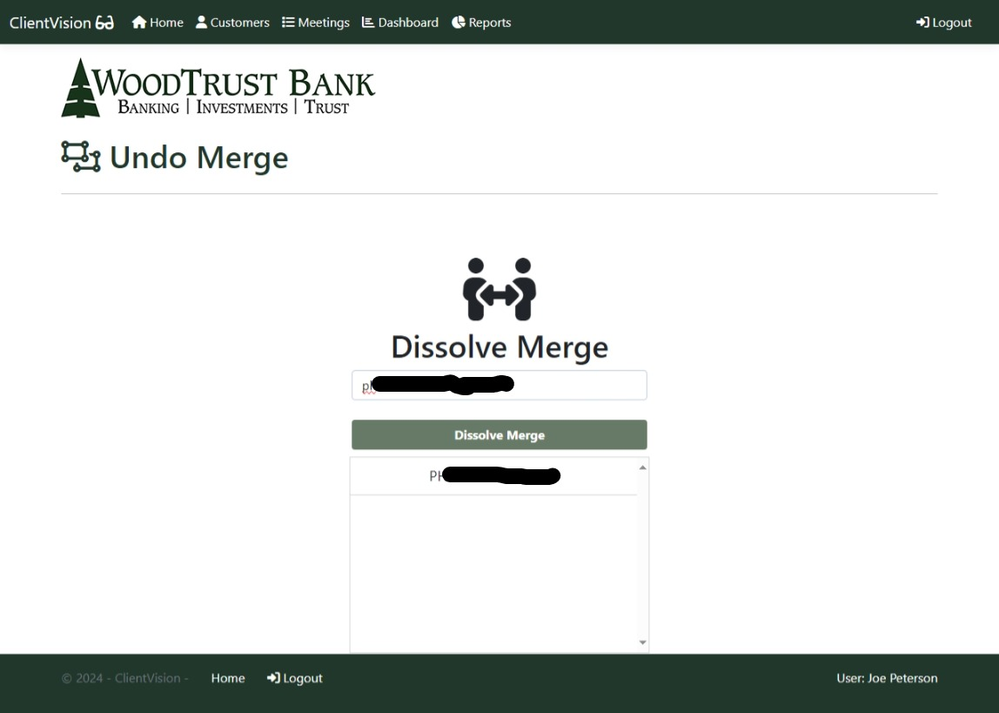

## Confirm Delete Page

## Suggestion Box Page

