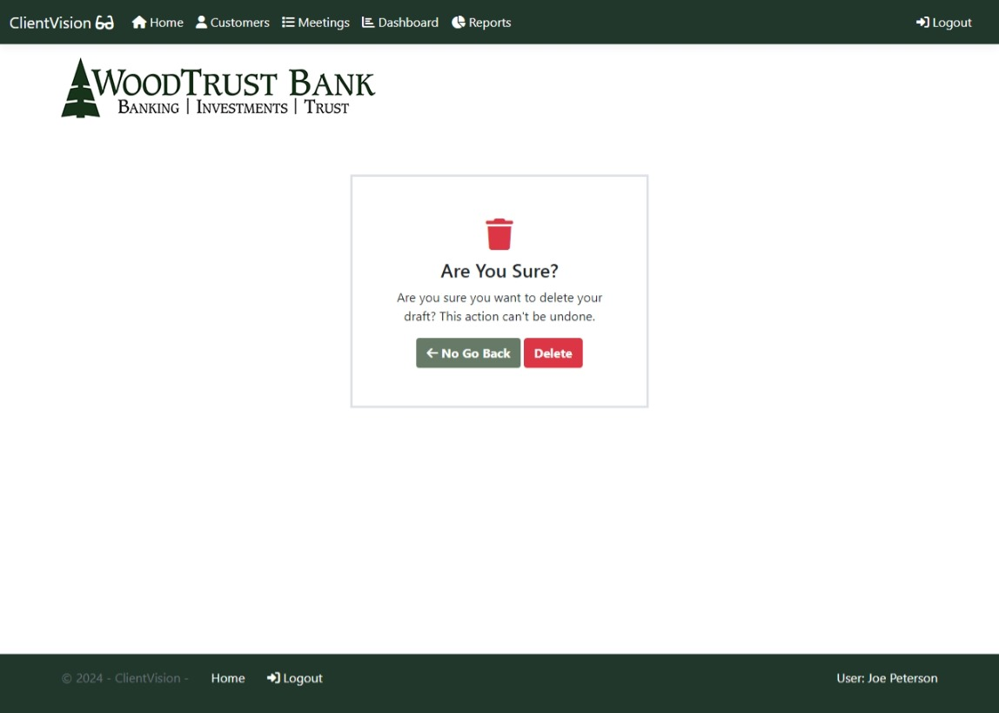
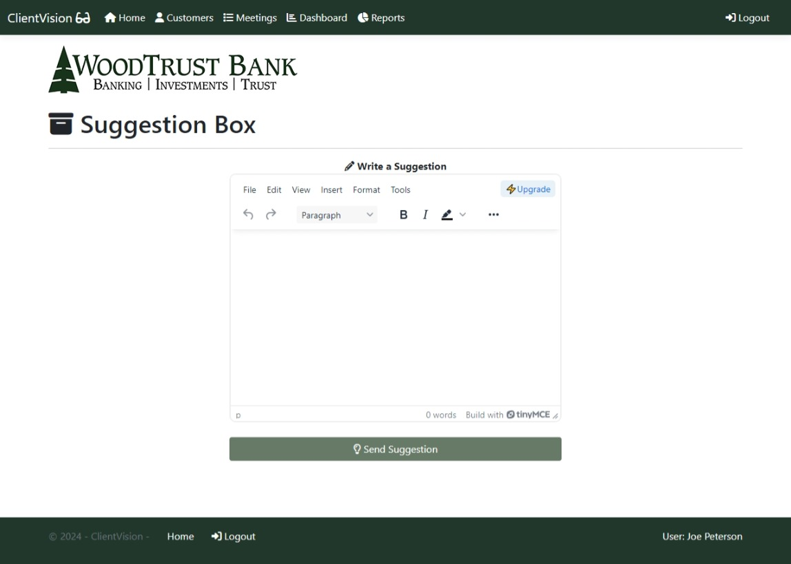

# ClientVision-CRM (Admin View)
ClientVision is a CRM web application built for WoodTrust Bank to manage customer + account data and also document interactions between bank employees and clients. 

## Home Page 

## Login Page
 

## All Customers Page

## Create Customer Page

## Customer Details Page
--Missing Image--

## Recent Customers Report Page

## Bank Relationships Page

## Adding/Removing Clients Bank Relationships Page

## Daily Report Bank Relationship Page

## All Meetings Page

## Meeting Notes Popups

## Meeting Filter Form Popup

## Create Meeting Page

## Meeting Details Page

## Report Generator Page

## Report Results Page

## Popup Email Report Results

## User dashboard Page (Admin)

## Merge Customer Records Page

## Dissolve Merge Page

## Confirm Delete Page

## Suggestion Box Page

